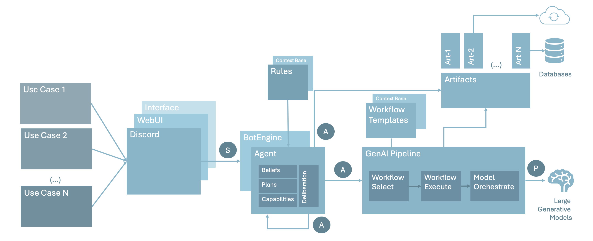

### [Understand](#owlmind) | [Get Started](#getting-started) | [Extend](#extending) | [Contribute](#contributing)

# OwlMind 

OwlMind Framework for Education and Experimentation with Generative Intelligence System, is being designed and build by the The Generative Intelligence Lab at Florida Atlantic University. The focus is on education, empowering students to rapidly achieve tangible outcomes by implementing consumable GenAI-based Agentic Systems. OwlMind aims to foster creativity and innovation by providing a flexible and user-friendly environment to build rule-based logic connected to GenAI workflows.

OwlMind is desinged to support a wide array of use cases, from simple rule-based automation to advanced AI-driven applications. Each element of the platform is part of a modular and efficient way of configuring and operating GenAI-powered systems. 




The core components include:

* **Bot Runner for Discord Bots**: acts as the interface to host and execute bots on platforms like Discord, providing users with a conversational agent to interact with.
* **Agentic Core**: provides deliberation at the heart of the platform, enabling users to define and configure rule-based systems.
* **Configurable GenAI Pipelines**: supports flexible and dynamic pipelines to integrate large-scale Generative AI models into workflows.
* **Workflow Templates**: offers pre-configured or customizable templates that simplify the Prompt Augmentation Process.
* **Artifacts**: represents modular components that connect agents to external functionalities, such as web-connection, databses, RAG systems,interacting with APIs,  and others
* **Model Orchestrator**: connects diverse Generative AI models into its pipelines, providing developers with flexibility and simplicity.


The Agentic Core adheres to the [Belief-Desire-Intention (BDI) framework](https://en.wikipedia.org/wiki/Belief–desire–intention_software_model) for agent-based systems. This cognitive architecture ensures that agents are capable of goal-oriented behavior by structuring their decision-making process around:
* **Beliefs**: represent the agent’s knowledge or perception of the environment. These beliefs act as the foundational understanding upon which the agent evaluates its actions.
* **Desires**: define the agent's objectives or goals it wishes to achieve, such as completing a workflow, retrieving specific data, or responding to user queries.
* **Intentions**: represent the plans or strategies the agent actively commits to in order to achieve its desires, balancing feasibility and optimality.
* **Plan Base**: A repository of predefined and dynamically generated plans; these plans serve as executable roadmaps for the agent to transform its intentions into actionable steps; the planBase ensures that agents can adapt to varying contexts and efficiently execute workflows based on their beliefs, desires, and current environment.
* **Capability Base**: defines agent’s operational capabilities, defining what the agent can do in terms of actions and interactions; connected to existing **Artifacts**.


## Getting Started

During this process you will:

1. Configure your Discord Bot 
2. Install OwlMind locally
3. Animate your Discord Bot with an OwlMind BotBrain
4. Customize your OwlMind BotBrain

Note: To follow this step you must have PYTHON3, PIP3 and GIT installed locally.

[How to install PYTHON and PIP?](https://packaging.python.org/en/latest/tutorials/installing-packages/)

[How to install GIT?](https://github.com/git-guides/install-git)


### (Step 1) Configure your Discord Bot 

Follow the instructions at: [How-to Configure a Discord Bot with Owlmind?](docs/discord.md)

* **Save the TOKEN** that you created thought this process; we will use it in Step 
* **Provide the URL to the Discord Server admin** for adding to the server. 
* Notice that **the Bot will be offline**  until you connect to the Bot Runner (next).

### (Step 2) Install OwlMind locally

(2.a) Clone the source from GitHub:

```
$ git clone https://github.com/GenILab-FAU/owlmind.git
```


### 3. Animate your Discord Bot with an OwlMind BotBrain

(3.a) Install the requirements:

Move inside the folder 'owlmind' and execute:

[How to install PYTHON and PIP?](https://packaging.python.org/en/latest/tutorials/installing-packages/)


```
$ cd owlmind
$ pip3 install --break-system-packages -r requirements.txt
```

Alternative:

```
$ python3 -m pip install --break-system-packages -r requirements.txt
```

(3.b) Setup the Discord Bot TOKEN
* Get the TOKEN you created in (Step 1)
* Create the file .env inside fodler 'owlmind':
```
# FILE :: .env
TOKEN=My_Token_Goes_Here
```

Alternatively, you can hard-code the TOKEN within bot-1.py:

```
# FILE :: bot-1.py

(...)
if __name__ == '__main__':
    (...)

    ## Alternative: Hard-code your TOKEN here and remote the comment:
    # TOKEN="My_Token_Goes_Here"

    (...)
    # Kick start the Bot Runner process
    bot = DiscordBot(token=TOKEN, brain=brain, debug=True)
    bot.run()
```


(3.c) Execute the 'getting started' BotMind:

```
$ python3 bot-1.py
```

It should startup like this:


At this point your Bot should be animated and you can chat with it on Discord:


## Extending


## Contributing


